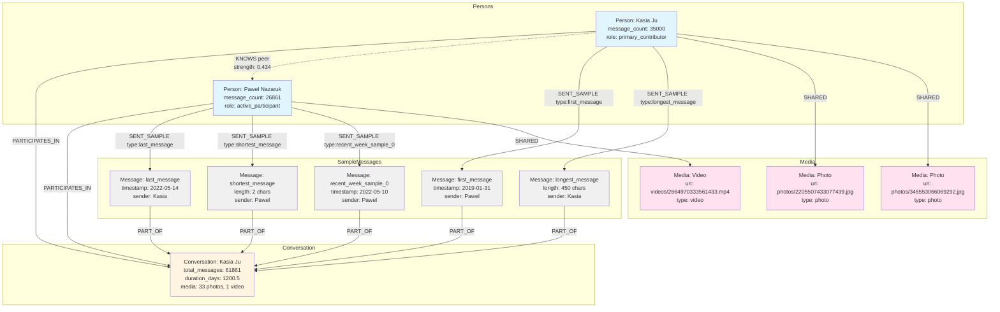

# Facebook Ontology - Visual Schema

## Graph Structure Diagram



## Relationship Types Legend

### Solid Lines (→) - Strong Relationships
- **PARTICIPATES_IN**: Person participates in conversation
- **SENT_SAMPLE**: Person sent this sample message
- **PART_OF**: Message belongs to conversation
- **SHARED**: Person shared this media file

### Dashed Lines (-.->) - Inferred Relationships
- **KNOWS**: People know each other (bidirectional)
  - Properties: relationship_type, interaction_strength, evidence
- **MENTIONS**: One person mentions another (directional)
  - Properties: mention_count, last_mentioned

## Node Color Coding

- 🔵 **Blue** (Persons): Human participants
- 🟡 **Yellow** (Conversation): Thread container with statistics
- ⚪ **Gray** (Messages): Sample messages (boundary cases)
- 🟣 **Pink** (Media): Photos, videos, gifs, files

## Example Query Paths

### Path 1: Get All Messages from Person
```
Person → SENT_SAMPLE → Message
```

### Path 2: Find Related People
```
Person → KNOWS → Person
```

### Path 3: Get Conversation Details
```
Person → PARTICIPATES_IN → Conversation
```

### Path 4: Find Shared Media
```
Person → SHARED → Media
```

### Path 5: Complete Profile
```
Person → SENT_SAMPLE → Message → PART_OF → Conversation
Person → KNOWS → Person
Person → SHARED → Media
```

## Storage Comparison

### Before (Traditional)
```
┌─────────────────────────┐
│ 61,861 Message Nodes    │
│ Each with full content  │
│ Total: ~2.2 MB          │
└─────────────────────────┘
```

### After (Condensed Ontology)
```
┌─────────────────────────┐
│ 2 Person Nodes          │
│ 1 Conversation Node     │
│ 5-15 Sample Messages    │
│ ~34 Media Nodes         │
│ Total: ~0.002 MB        │
│ Reduction: 99.9%        │
└─────────────────────────┘
```

## Data Flow

```
Facebook JSON Export
        ↓
  Parse & Validate
        ↓
  Analyze Patterns
        ↓
   ┌────┴────┐
   ↓         ↓
Statistics  Samples
   ↓         ↓
Create Nodes & Relationships
        ↓
   Neo4j Database
        ↓
  Query Interface
```

## Key Metrics Preserved

Despite 99.9% storage reduction, we preserve:

✅ **Who**: Participant identities and roles  
✅ **When**: Temporal boundaries (start/end dates)  
✅ **How Much**: Message counts, participation percentages  
✅ **What Type**: Media inventory (photos, videos, etc.)  
✅ **Relationships**: Who knows whom, interaction strength  
✅ **Content Samples**: Boundary cases (first, last, longest, shortest)  
✅ **Recent Activity**: Last week samples for current state  

## Scalability

This pattern scales to:
- ✅ Multiple conversations per person
- ✅ Cross-conversation relationship analysis
- ✅ Network-level metrics (centrality, clustering)
- ✅ Temporal trend analysis
- ✅ Integration with other data sources (municipal ontology, etc.)
